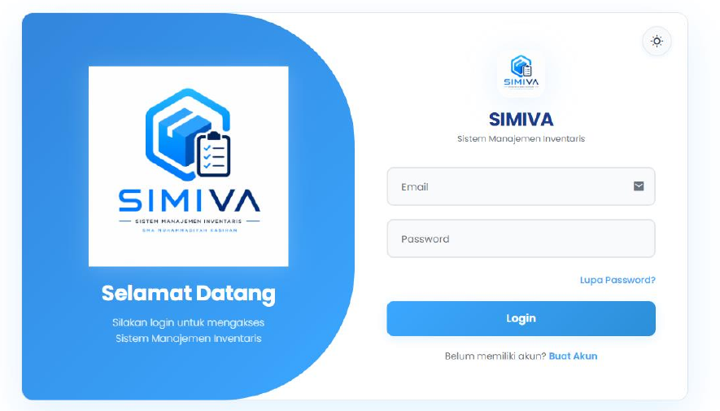
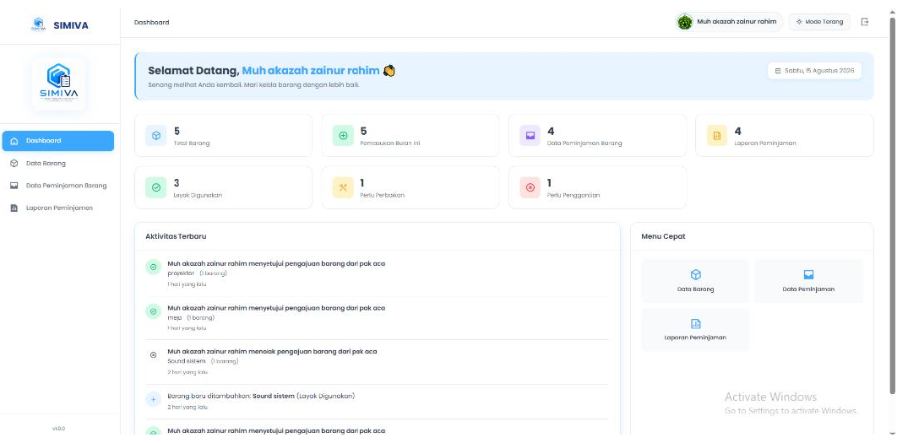
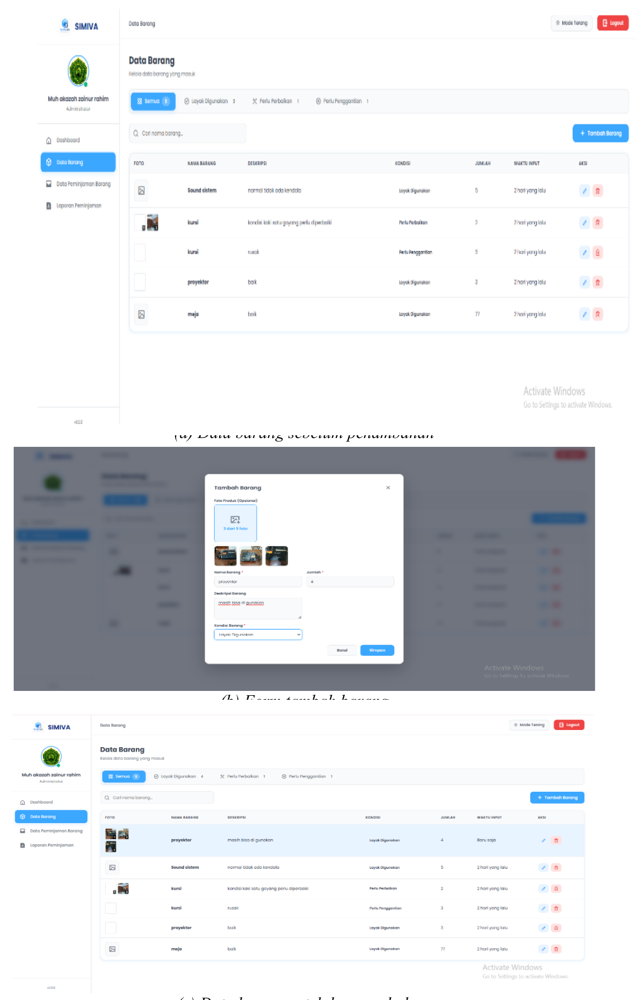
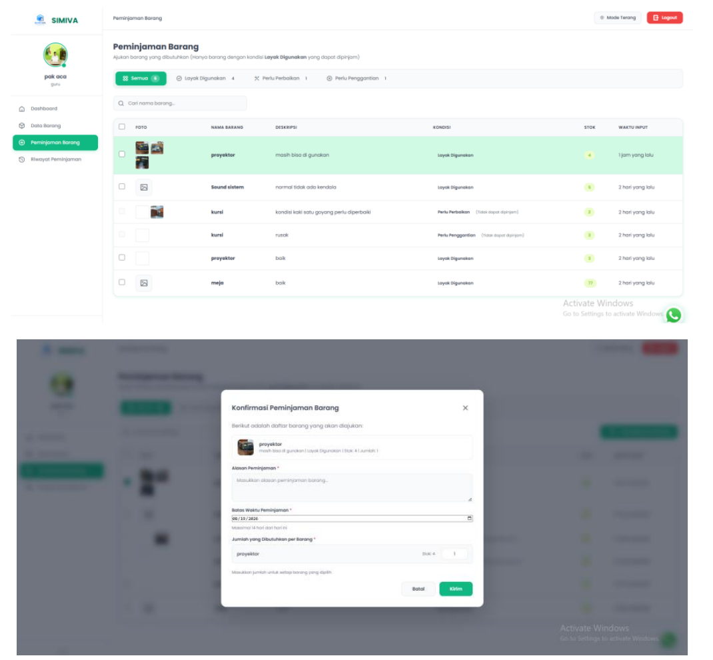
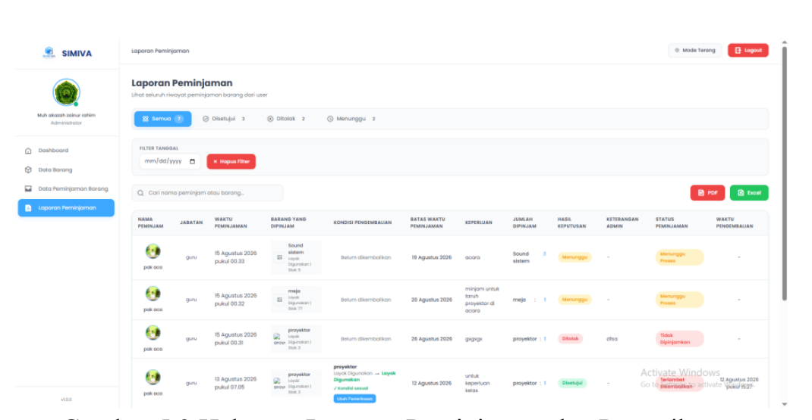
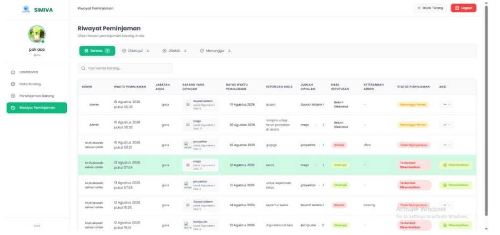

# AF Project Inventaris

**SIMIVA — Sistem Manajemen Inventaris Berbasis Web**

Sistem inventaris berbasis web yang dikembangkan untuk membantu proses pengelolaan data barang, pemantauan stok dan kondisi barang, peminjaman, pengembalian, serta laporan inventaris.

Sistem memiliki dua jenis pengguna utama, yaitu **Admin** dan **User**, dengan hak akses dan fungsi yang berbeda.

---

## Fitur Utama

### Admin

- Login admin
- Dashboard admin
- Mengelola data barang
- Menambah data barang
- Mengubah data barang
- Menghapus data barang
- Mengelola stok barang
- Mengelola kondisi barang
- Melihat data peminjaman
- Memproses pengajuan peminjaman
- Mengelola pengembalian barang
- Melakukan pemeriksaan pengembalian
- Melihat laporan peminjaman

### User

- Login user
- Dashboard user
- Melihat data barang
- Melihat ketersediaan stok
- Melihat kondisi barang
- Mengajukan peminjaman barang
- Memantau status peminjaman
- Mengajukan pengembalian barang
- Melihat riwayat peminjaman dan pengembalian

### Server

- Backend berbasis Node.js
- Koneksi Firebase
- Firebase Authentication
- Cloud Firestore
- Pengelolaan data inventaris
- Pengelolaan data pengguna
- Pengelolaan data peminjaman

---

## Teknologi yang Digunakan

- HTML
- CSS
- JavaScript
- Node.js
- Firebase
- Firebase Authentication
- Cloud Firestore

---

## Struktur Folder

```text
AFProject_Inventaris/
├── Admin/
├── Server/
├── User/
├── docs/
│   ├── login.png
│   ├── dashboard-admin.png
│   ├── data-barang.png
│   ├── peminjaman-barang.png
│   ├── laporan-peminjaman-admin.png
│   └── riwayat-peminjaman.png
├── .gitignore
└── README.md
```

---

# Tampilan Sistem

## 1. Login Admin

Halaman login digunakan oleh admin untuk masuk ke dalam sistem sebelum mengakses fitur pengelolaan inventaris.



---

## 2. Dashboard Admin

Dashboard admin menampilkan informasi utama sistem dan menjadi pusat navigasi menuju pengelolaan data barang, peminjaman, dan laporan.



---

## 3. Data Barang Admin

Halaman data barang digunakan untuk mengelola informasi inventaris seperti nama barang, foto, kondisi, jumlah stok, serta informasi ketersediaan barang.



---

## 4. Peminjaman Barang User

User dapat melihat barang yang tersedia, memilih barang yang ingin dipinjam, menentukan jumlah, mengisi alasan peminjaman, serta mengirim permintaan kepada admin.



---

## 5. Laporan Peminjaman Admin

Halaman laporan digunakan admin untuk memantau proses peminjaman, pengembalian, serta pemeriksaan kondisi barang setelah dikembalikan.



---

## 6. Riwayat Peminjaman User

User dapat melihat riwayat peminjaman, status transaksi, batas waktu peminjaman, serta melakukan pengajuan pengembalian barang.



---

## Kondisi Barang

Sistem mendukung pengelompokan kondisi inventaris menjadi:

- Tidak Rusak
- Rusak Ringan
- Rusak Sedang
- Rusak Berat

Informasi kondisi digunakan untuk membantu proses pemantauan barang dan pengelolaan inventaris.

---

## Alur Sistem

```text
User Login
    ↓
Dashboard User
    ↓
Melihat Data Barang
    ↓
Mengajukan Peminjaman
    ↓
Admin Memproses Pengajuan
    ↓
Peminjaman Disetujui / Ditolak
    ↓
Barang Digunakan
    ↓
User Mengajukan Pengembalian
    ↓
Admin Memeriksa Barang
    ↓
Transaksi Selesai
```

---

## Keamanan Repository

File konfigurasi atau credential Firebase yang bersifat rahasia tidak disertakan di repository publik.

File seperti berikut harus tetap berada di `.gitignore`:

```text
node_modules/
.env
.env.*
*.pem
*.key
Server/serviceAccount.json
```

---

## Status Project

**Prototype / Academic Project**

Project ini dikembangkan sebagai Sistem Manajemen Inventaris Berbasis Web untuk membantu pengelolaan inventaris, peminjaman, pengembalian, dan penyampaian informasi barang secara terintegrasi.

---

## Developer

**AF Project**

Flutter • Web • Basic IT • Digital Services  
**Code. Create. Solve.**
